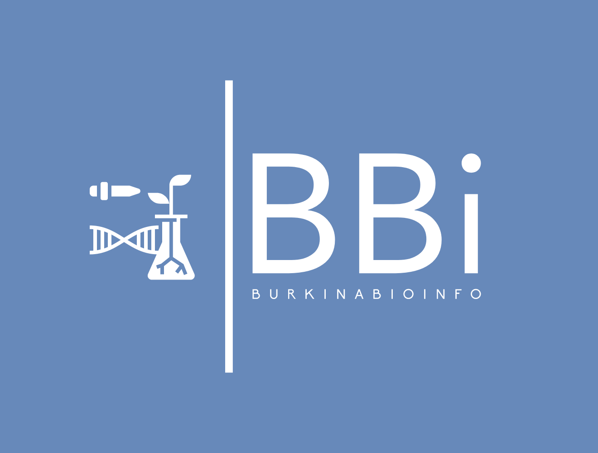
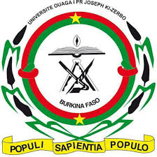
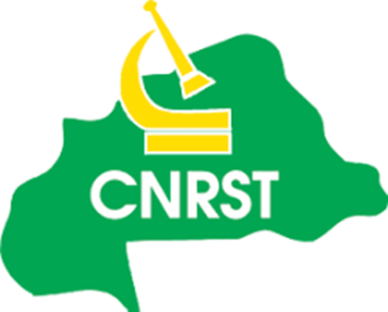

## Contact
For inquiries or collaboration opportunities, please contact us at:
bioinfo@ujkz.bf

### License

The resource material is licensed under the Creative Commons Attribution 4.0 International License. To view a copy of this license, visit http://creativecommons.org/licenses/by-nc-sa/4.0/

