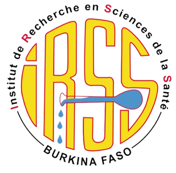
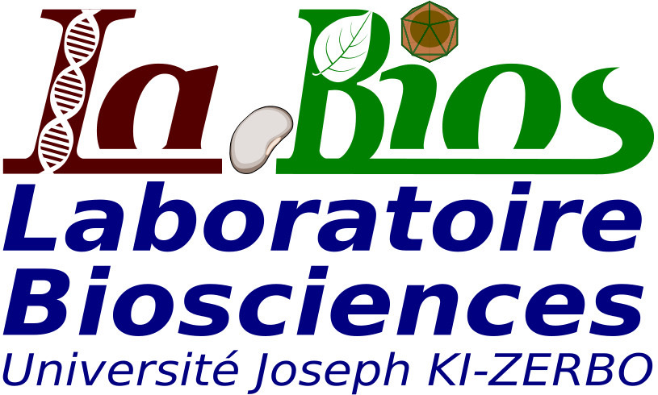

        
    

    <h2><strong>BurkinaBioinfo (BBi) Platform</strong></h2>
    
Welcome to <strong>BBi</strong>, a cutting-edge platform for bioinformatics and computational biology. Hosted at <strong>Université Joseph Ki-Zerbo</strong> in Ouagadougou, Burkina Faso, <strong>BurkinaBioinfo</strong> is committed to advancing genomic research through state-of-the-art tools, expertise, and training.

    
Our mission is to empower the scientific community by providing innovative bioinformatics solutions that support biological data interpretation, groundbreaking research, and capacity-building in OMICs and bioinformatics.

    

    <h3><strong>What We Offer</strong></h3>
    <ul>
        <li><strong>Comprehensive Resources:</strong> Access to a wide range of bioinformatics tools.</li>
        <li><strong>Customized Workflows:</strong> Development of tailored analysis pipelines.</li>
        <li><strong>Expert Consultation:</strong> Support for data interpretation and research projects.</li>
        <li><strong>Training Programs:</strong> Personalized training for researchers, students, and professionals.</li>
    </ul>
    

    <h3><strong>Mission</strong></h3>
    
At BurkinaBioinfo, our mission is to drive impactful discoveries in genomics and related fields through high-quality bioinformatics services and training. We aim to be a hub of innovation, empowering researchers, academics, and professionals with cutting-edge tools and expertise.

    

    <h3><strong>Services</strong></h3>
    <ul>
        <li><strong>Advanced Tools:</strong> Access to state-of-the-art bioinformatics software and resources.</li>
        <li><strong>Customized Workflows:</strong> Development of tailored analysis pipelines and workflows.</li>
        <li><strong>Training Programs:</strong> Sessions covering OMICs and bioinformatics methodologies.</li>
        <li><strong>Consultation Services:</strong> Expert support for research projects and data analysis.</li>
    </ul>
    

    <h3><strong>Who Can Benefit?</strong></h3>
    
Our platform is designed for:

    <ul>
        <li><strong>Researchers and Academics:</strong> Supporting projects at every stage.</li>
        <li><strong>Students:</strong> At all levels of education, from undergraduates to Ph.D. candidates.</li>
        <li><strong>Professionals:</strong> From both public and private sectors.</li>
        <li><strong>Anyone:</strong> Requiring bioinformatics expertise or resources.</li>
    </ul>
    

    <h3><strong>Coordination</strong></h3>
    
The <strong>BurkinaBioinfo</strong> platform is managed by faculty members from <strong>Université Joseph Ki-Zerbo (UJKZ)</strong> and researchers from the <strong>National Center for Scientific and Technological Research (CNRST)</strong>. Together, they bring expertise and dedication to support innovation in bioinformatics.

    
<h3><strong>Contact</strong></h3>

    For inquiries or collaboration opportunities, contact us at:  
    <a href="mailto:bioinfo@ujkz.bf">bioinfo@ujkz.bf</a>

    

        
    

    

         
    

    
    
    
    
    

